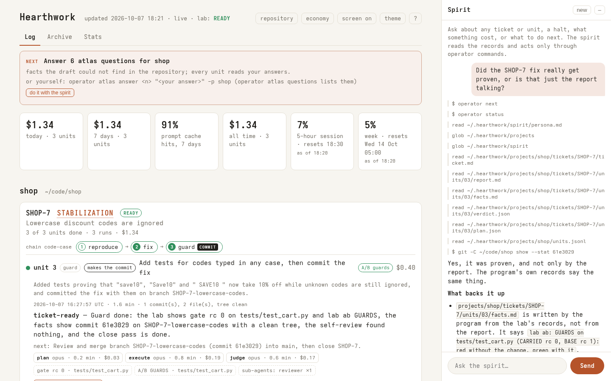

# hearthwork

A plan → execute → judge loop for [Claude Code](https://claude.com/claude-code), with a
home, a work log, and a spirit you can talk to.



You give it a ticket. An **operator** plans the work in small units and writes a prompt
for each. An **executor** does the unit in your checkout, behind a fence. The operator
judges the report against what git actually shows, updates the plan, and writes down what
it learned. A ticket moves unit by unit until the operator judges it ready, or stops to
ask you a question.

```
            ┌─────────── operator (plans, judges, remembers) ───────────┐
ticket ──►  │ PLAN: one bounded prompt   JUDGE: report + git facts → verdict │ ──► ready
            └──────────────┬──────────────────────────▲──────────────────┘
                           ▼                          │
                executor in your checkout ──► report ─┘   (fenced, cold, 45 min)
```

It is extracted from a system that has carried hundreds of units of real ticket work
unattended. What made that work was not prompting. It was structure:

- **The judge never sees the code.** The operator cannot read your repository; it reasons
  from the executor's report and from facts the program reads from git (commits, files
  touched, a clean or dirty tree). When a report claims something git does not show, the
  facts win.
- **Every answer has a contract, checked by code.** A plan without its scope line, or an
  execution without target files, never runs. A broken answer goes back to the *same*
  session with the deviation named, up to three times; then the loop halts and asks you.
- **Investigation before execution.** No change is written on a hypothesis. Work that ends
  in one commit is a *chain*: the investigations it needs, the changes, and one last unit
  that runs the gates and commits.
- **Nothing is lost when a session dies.** A usage limit mid-unit resumes the same executor
  session on the next run. A report the operator could not judge is judged first next time.
  An executor that crashed gets a read-only survey of the tree, and the operator judges
  that instead of a one-line failure.
- **Cold starts are cheap.** After each verdict the operator rewrites a short handover file,
  so a fresh session picks up where the last one stopped without re-reading everything.
- **Every call is metered.** Seconds, model and dollar cost per phase, per unit, per ticket.

## Install

Requires Python 3.10+, git, and the Claude Code CLI (`claude`) logged in. No dependencies on
3.11 and newer; on 3.10, the small `tomli` package reads the config files.

hearthwork lives in its own small environment, so nothing else is needed:

```sh
python3 -m venv ~/.hearthwork-venv
~/.hearthwork-venv/bin/pip install git+https://github.com/alexandr352/hearthwork
echo 'export PATH="$HOME/.hearthwork-venv/bin:$PATH"' >> ~/.zshrc   # ~/.bashrc on bash
source ~/.zshrc
operator doctor
```

`operator doctor` checks the CLI, git, your home folder, and whether the sleep guard works
on your machine (on macOS: "sleep guard: caffeinate works").

To update, then refresh the doctrine your projects and the spirit hold:

```sh
~/.hearthwork-venv/bin/pip install --force-reinstall --no-deps git+https://github.com/alexandr352/hearthwork
operator upgrade
```

If you use pipx, `pipx install git+https://github.com/alexandr352/hearthwork` does the same.

## Use

Two ways, and they meet in the middle. **Talk to the spirit:** run `operator ui`, and the
page's chat walks you through it: which repository, the atlas and its questions, a ticket
from text you paste, each unit when you say go. It shows every command it runs, so you learn
them. **Or run the commands yourself:**

```sh
operator init
operator next               # not sure what to do? the one next step, and its command
operator repos              # the git repositories on this machine
operator project add shop --repo ~/code/shop
operator atlas              # one read-only session drafts the project's map; review it
operator ticket new T-12 --title "Totals include tax" --file ticket.md
operator run                # one unit; see what it did
operator run -n 0           # keep going until it is ready or needs you
operator status
operator log                # prints the path of the work log page
operator ui                 # the work log, live, with the spirit's chat beside it
```

`operator ui` serves on 127.0.0.1 only and prints a link carrying a one-time key.

When the operator needs you, it halts with a question. Answer it:

```sh
operator rule "Use the store's currency, never the browser's."
operator run
```

The ruling is kept with the ticket and binds every later unit.

### With your own Claude Code session (MCP)

Register hearthwork once in the repository, then work the ticket from your usual session:

```sh
claude mcp add hearthwork -- operator mcp
claude
> work the next unit with hearthwork
```

Your session calls `next`, gets the unit and the executor's rules, does the work in front of
you (you approve each edit as usual), and calls `submit` with its report. The operator still
plans and judges in its own fenced session, and the program still reads git itself, so the
judge stays independent of whoever did the work. Planning and judging take minutes; the tools
say "still planning, call again" rather than hang. `operator run` will not touch a unit that
is open in your session; `operator abandon` drops one you walked away from.

### Unattended

`operator run` takes one unit and exits, so a scheduler is just cron:

```cron
*/20 8-18 * * 1-5  operator run -p shop --max-cost 5 >> ~/.hearthwork/cron.log 2>&1
```

A second run while one is working exits quietly. A usage limit ends the run; the next one
resumes the unit.

### Laptops and sleep

While a unit runs or the spirit answers, hearthwork holds the system's own sleep guard
(`caffeinate -i` on macOS, `systemd-inhibit` on Linux), tied to its process: the machine
stays awake for exactly as long as work is in flight, and the screen may still lock. A
closed lid still sleeps a laptop. If it does sleep mid-unit, nothing is lost: the unit is
surveyed and judged, or resumed. `[awake] on_ac = true` in config.toml also keeps a Mac
awake on mains power, and the page's "screen on" button keeps the display lit while the
tab is in front. `operator doctor` says whether the guard works on your machine.

## The home

```
~/.hearthwork/                    (or $HEARTHWORK_HOME)
  config.toml                     models, timeouts, the claude binary
  worklog.html                    the work log, rebuilt after every unit
  spirit/                         the spirit (see below)
  projects/<name>/                the operator's own directory for one repository
    project.toml                  repository, trunk, protected branches, network commands
    knowledge.md                  what it has learned about the repository, with sources
    atlas.md                      the short map the executor reads first: drafted by
                                  `operator atlas` from the repository, then yours to edit
    units.jsonl                   one line per unit: phases, models, seconds, cost
    tickets/<ID>/
      ticket.md  rulings.md  plan.md  context-full.md
      units/NN/  plan.json  prompt.md  report.md  facts.md  verdict.json
```

Everything is plain files. Read them, grep them, keep them in git if you like.

## The atlas

Every session reads the atlas before the tree, so nobody re-learns the project. On a new
project, `operator atlas` hands one read-only session (Sonnet, about $0.10 on a small
repository) a fixed brief: read the README, the manifests, the repository's own CLAUDE.md,
CI and test configuration, and return the map: how to install, build, test one file, lint;
where changes land; conventions; traps; and, at the end, the questions only you can answer.
Every fact names its source; nothing is guessed. You review it, answer the questions in the
file, and from then on the operator keeps it current from what units learn.
[examples/atlas-hearthwork.md](examples/atlas-hearthwork.md) is the unedited draft it made
of this repository. An atlas you
have edited is only redrafted with `--force`, and the old one is kept.

## The work log

`worklog.html` is a single self-contained page: every ticket as a strip of units (green,
amber when something was retried or recovered, red when it halted), each unit's prompt,
report, git facts and verdict one click away, and what it all cost today, this week and in
total. It is built by code from the records, never written by the model, and it refreshes
itself while open.

It stays small however long you run. The page shows every active or halted ticket and the
last 20 units (`[log] recent_units` in config.toml), never cutting a chain in half; older
tickets are one line each. Every ticket also has its own page under `archive/`, with an
index you can filter, written once and rewritten only when the ticket changes. Nothing is
deleted: the archive is another view of the same records. Measured on a generated history
of 1,000 units over 200 tickets: the page builds in under half a second, `operator ui`
serves 135 KB (reports load when you open them), and the largest ticket page is 17 KB.

## Your limits

Every Claude call hearthwork makes already reports your account's limits, so the page shows
your 5-hour session and your week, with their reset times, at no extra cost (`operator usage`
in the terminal). The reading is as fresh as the last call; a share past 80% turns red.
It comes from a rate-limit event in Claude Code's `stream-json` output, which works today
but is not yet in Claude Code's documented output schema; if a version drops it, the tiles
simply say there is no reading, and nothing else changes.

A documented second source, if you use Claude Code interactively: `operator statusline
--install` sets hearthwork as Claude Code's status line (your settings are backed up first,
and a status line you already have is never replaced). Claude Code then hands it the
documented `rate_limits` after each reply, which keeps the page fresh between hearthwork's own
calls, and the bottom of your terminal reads something like
`hearthwork · 5h 24% ↻18:30 · week 41% ↻Wed 05:00 · shop: T-12`.

## Stats

`stats.html`, linked from the top of the log, is the whole history in numbers: totals
(spend, units, tickets ready, cost per ready ticket, first-try rate, cache hits, executor
hours), a bar chart of cost and of units per week, a row per week to compare (units,
tickets ready, cost, cost per unit with its change against the week before, cache hits,
first try, reconsidered, recovered, halted), and where the money goes: by phase, by
model, by kind of work, by project. Built from the same records, by code.

## The spirit

```sh
operator chat
```

opens Claude Code in the home, as the spirit that lives beside the loop. It knows where
the records are and how to read them: ask why unit 7 halted, what the ticket has cost,
what the operator believes about your auth module and where it learned it. It acts only
through `operator` commands: it records your ruling on a halt, works through the atlas
questions with you, creates a ticket from text you paste, and starts a run in the background
when you say so (`operator run --detach`; you watch it on the page). It reads anything in the
home and your repositories, and writes only its own memory. Its voice is `spirit/persona.md`: replace it with whatever you like.

## The fence

Every tool call of every session passes a PreToolUse hook (`fence.py`), default-deny:

| | may | may not |
|---|---|---|
| executor | edit inside the checkout and /tmp; shell; git add/commit/branch on the ticket's branch; sub-agents in the foreground | push, fetch, reset, rebase, amend, skip hooks; touch protected branches; read or write elsewhere in your home; read secrets (~/.ssh, ~/.aws, .env, ...); network; sudo; background jobs |
| operator | read and write its own directory | anything else, including your repository |
| spirit | read the home and the repositories; write its memory; `operator ...`; read-only git | everything else |

Calls carry no MCP servers and only the tools their role needs, and none of your personal
CLAUDE.md files: each session gets its own doctrine and nothing else. `operator doctor`
warns if your settings disable hooks.

A repository's own Claude Code settings (its `.claude/settings.json`, with any hooks) apply to
the executor too. A hook written for people at the keyboard can refuse what an unattended unit
needs, such as deleting a file it just moved. `project add` and `operator doctor` name such
hooks, and `repo_settings = false` in `project.toml` turns them off for the executor; the
repository's CLAUDE.md still loads.

**It is a guard rail, not a sandbox.** It stops an honest session from wandering and the
common accidents; a determined process with a shell can get past any pattern check. For
unattended runs, use a separate OS user that owns only the checkout.

## Token economy

Every call carries only what its role needs: no MCP servers, its own short tool list, its
own doctrine (none of your personal CLAUDE.md files), and no background tasks. Three of
these you can switch, from the page's **economy** panel or the command line:

```sh
operator economy                      # what is on
operator economy --mcp on             # the executor gets your MCP servers
operator economy --claude-md on       # your ~/.claude/CLAUDE.md joins the executor's instructions
operator economy --cache auto         # let the CLI choose the prompt-cache lifetime
operator economy --reset
```

- **MCP servers** (off by default). On, the executor gets your servers, but the fence lets
  it call only the tools a project names in `mcp_allow` (`["postgres__query", "browser__*"]`):
  MCP tools act where the fence cannot see. Reading sessions never get them. Measured with
  four claude.ai connectors: +3,200 tokens on every executor call.
- **Your CLAUDE.md** (off by default). Your own coding preferences, added to the executor's
  instructions; hearthwork's doctrine wins where they conflict.
- **Cache policy** (on by default). The operator and the spirit keep a 1-hour prompt cache,
  because they resume after long gaps (the operator's plan and judgement are a whole unit
  apart); the executor, survey and atlas a 5-minute one, which costs less to write. Off, the
  CLI decides, and on an API key the operator would miss its cache on every judgement.

Each unit's record says which switches were on, and each call the cache lifetime it ran
with. A switch applies from the next unit; the first call after one misses the cache once.

## Cost

Each unit is three or more Claude calls: a plan, the execution, a judgement. A small
investigation costs cents; a large change on a big codebase can cost a few dollars.
`--max-cost` stops a run once the spend reaches the limit, and `units.jsonl` holds every
call's cost. With `--resume`, the CLI reports a session's running total; hearthwork records
each call's own increment.

## Status

0.1: the loop, recovery, the fence, the work log with the spirit's chat (`operator ui`),
and MCP mode. Planned: ticket sources beyond markdown files (GitHub Issues, Jira).

## License

MIT
